# Ethical Hacking Lab: Kali Linux & Metasploitable 2

A virtual cybersecurity lab built with Oracle VirtualBox, a Kali Linux security workstation, and a Metasploitable 2 target.

**Author:** Isabelle Jean  
**Course:** CS352 | Lab 1  
**Completed:** September 18, 2026

## Overview

I built this environment to practice authorized security testing throughout my course. I installed Kali Linux, configured an existing Metasploitable virtual disk, connected both VMs to a host-only network, assigned static IP addresses, and created baseline snapshots for recovery.

This repository documents the setup and validation work. Scanning and exploitation are outside the scope of this first lab. All future testing must remain within the instructor-approved environment.

## Skills practiced

- Virtual machine deployment and Linux installation
- VirtualBox host-only networking and DHCP configuration
- Static IPv4 addressing and subnet masks
- Linux command-line configuration and connectivity checks
- Guest integration package verification
- Snapshot creation and technical documentation

## Lab configuration

| Component | Configuration |
| --- | --- |
| Hypervisor | Oracle VirtualBox on Windows |
| Kali VM | Kali-Lab |
| Kali resources | 4096 MB RAM, 2 processors, 80 GB VDI |
| Target VM | Metasploitable-Lab |
| Target resources | 1024 MB RAM, 1 processor, 8 GB VMDK |
| Network | 192.168.56.0/24 |
| Host-only adapter | VirtualBox Host-Only Ethernet Adapter |
| Host adapter address | 192.168.56.1/24 |
| DHCP server | 192.168.56.2 |
| DHCP pool | 192.168.56.100–192.168.56.254 |
| Kali static address | 192.168.56.10/24 |
| Metasploitable static address | 192.168.56.20/24 |
| Subnet mask | 255.255.255.0 |

The two static addresses are outside the DHCP pool. Both VMs use the same host-only adapter. The course instructions refer to `vboxnet0`; on my Windows host, the adapter appears as **VirtualBox Host-Only Ethernet Adapter**.

Host-only networking allows the VMs and host to communicate without directly connecting the VMs to my regular network. The host is still reachable on this network, so testing remains limited to approved lab targets.

## 1. Deploy the virtual machines

I completed the Kali graphical installation and verified that the desktop loaded. For Metasploitable, I attached the existing `Metasploitable.vmdk` disk and verified a successful console login.

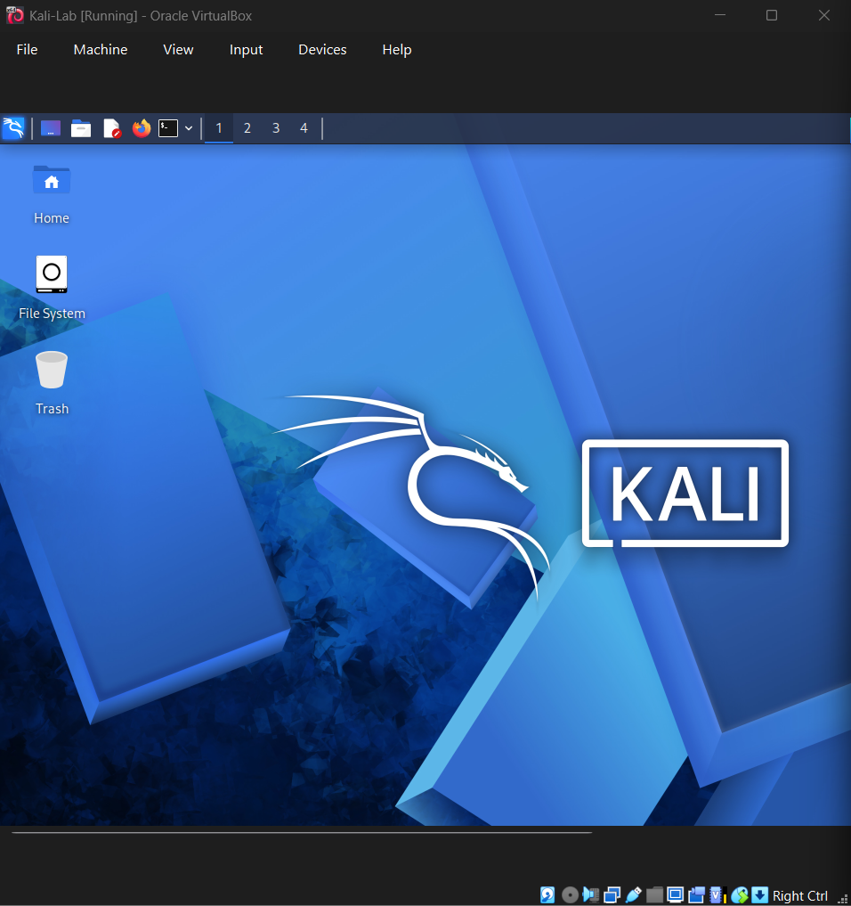
*Figure 1. Kali Linux running after installation.*

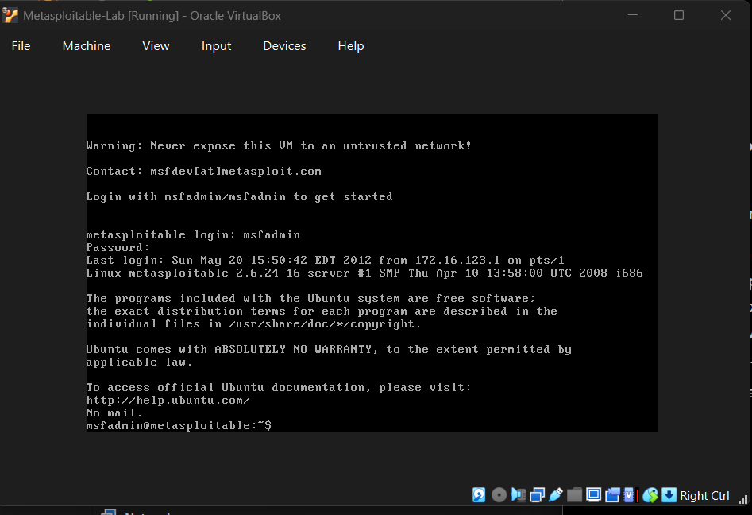
*Figure 2. Metasploitable running with a successful login.*

## 2. Configure host-only networking

I enabled DHCP for the host-only network and configured the required pool. Adapter 1 on both VMs uses the same host-only adapter with the virtual cable connected. Kali uses **Allow VMs** for promiscuous mode.

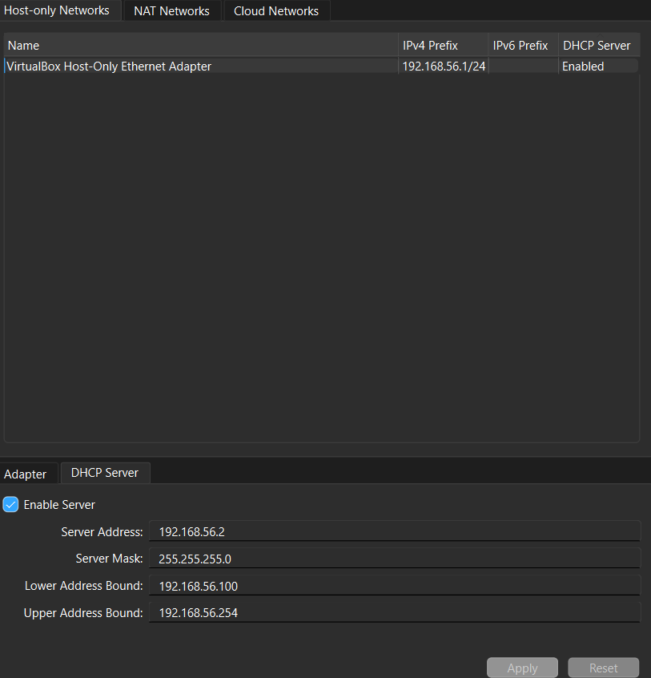
*Figure 3. Host-only network and DHCP settings.*

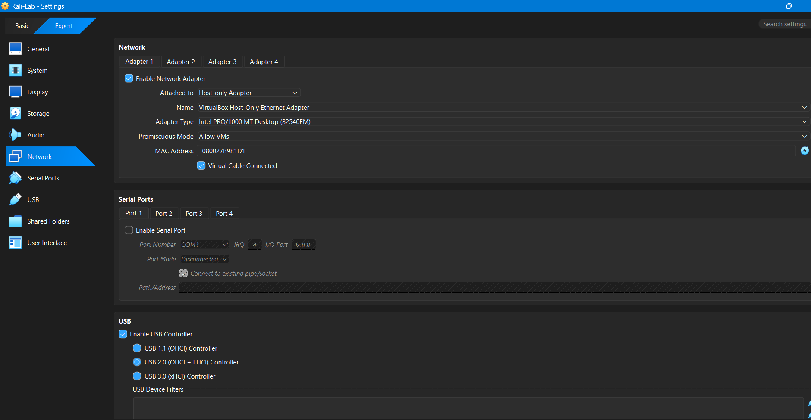
*Figure 4. Kali host-only adapter configuration.*

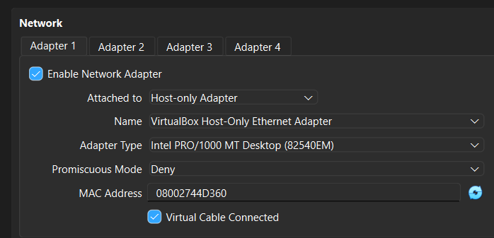
*Figure 5. Metasploitable host-only adapter configuration.*

## 3. Assign static IP addresses

### Kali Linux

I used the NetworkManager profile `Wired connection 1` for interface `eth0`:

```bash
sudo nmcli connection modify "Wired connection 1" ipv4.method manual ipv4.addresses 192.168.56.10/24 ipv4.gateway "" ipv4.dns "" ipv4.never-default yes
sudo nmcli connection up "Wired connection 1"
ip -br addr
```

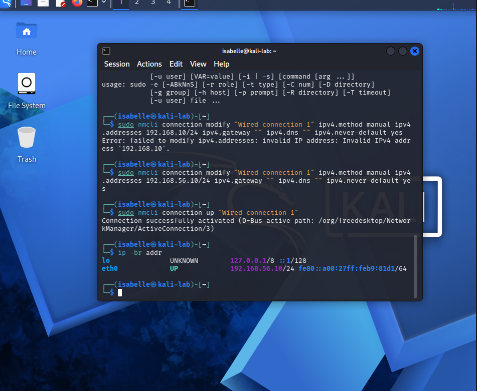
*Figure 6. Kali eth0 is up with address 192.168.56.10/24.*

### Metasploitable

I edited `/etc/network/interfaces` to use this configuration:

```text
auto lo
iface lo inet loopback

auto eth0
iface eth0 inet static
    address 192.168.56.20
    netmask 255.255.255.0
```

After saving and rebooting, I checked the address with:

```bash
ifconfig eth0
```

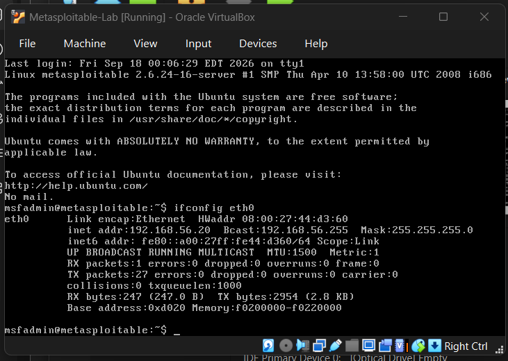
*Figure 7. Metasploitable eth0 uses 192.168.56.20 with mask 255.255.255.0.*

## 4. Validate the environment

| Check | Recorded result | Evidence |
| --- | --- | --- |
| Kali boots and login works | Successful | Desktop screenshot |
| Metasploitable boots and login works | Successful | Console screenshot |
| Kali static address | 192.168.56.10/24 | IP screenshot |
| Metasploitable static address | 192.168.56.20/24 | IP screenshot |
| Kali to Metasploitable ping | 4 sent, 4 received, 0% loss | Ping screenshot below |
| Metasploitable to Kali ping | 4 sent, 4 received, 0% loss | Ping screenshot below |
| Kali guest integration packages | Installed | Package listing screenshot |
| Baseline snapshots | Created for both VMs | Snapshot screenshots |

The connectivity checks were:

```bash
# From Kali
ping -c 4 192.168.56.20

# From Metasploitable
ping -c 4 192.168.56.10
```

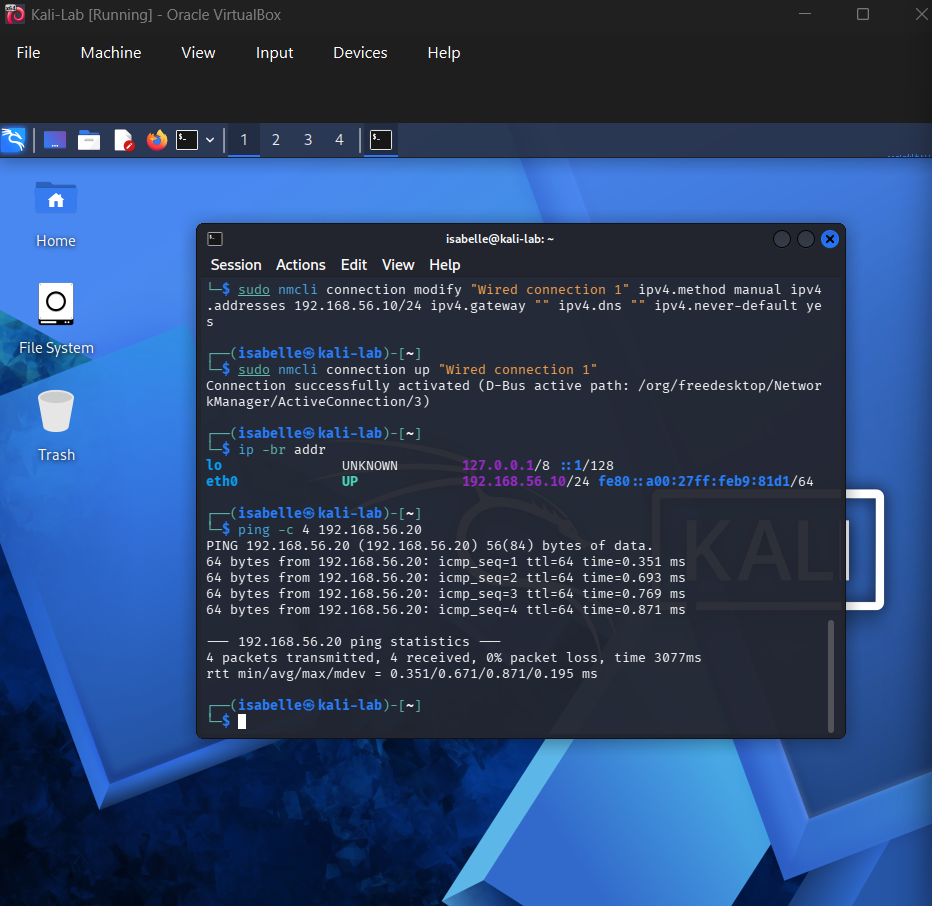
*Connectivity evidence A. Kali (192.168.56.10) pinging Metasploitable (192.168.56.20): 4 packets transmitted, 4 received, 0% packet loss.*

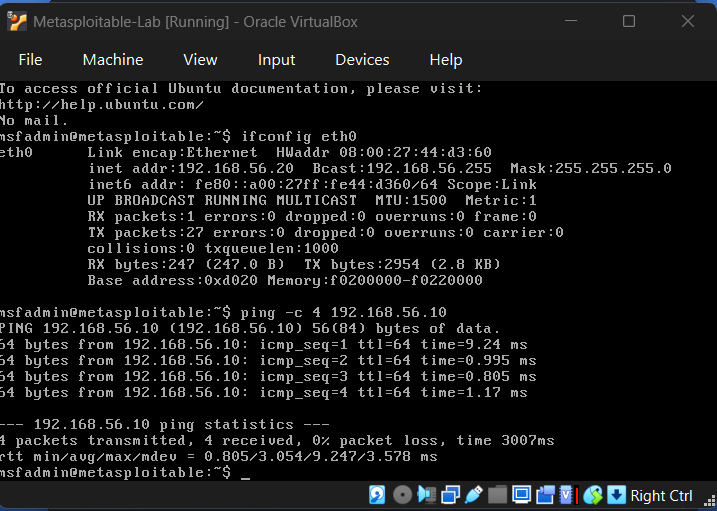
*Connectivity evidence B. Metasploitable (192.168.56.20) pinging Kali (192.168.56.10): 4 packets transmitted, 4 received, 0% packet loss.*

These checks verified communication between the two lab addresses. They do not by themselves prove network isolation; the adapter configuration documents that part of the setup.

I also checked Kali guest integration packages:

```bash
dpkg -l virtualbox-guest-utils virtualbox-guest-x11
```

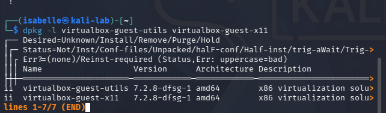
*Figure 8. Both packages show installed status (`ii`).*

## 5. Create recovery snapshots

I shut down both VMs before creating the snapshots.

| Virtual machine | Snapshot | Date created | Time shown by VirtualBox |
| --- | --- | --- | --- |
| Kali-Lab | Lab_Baseline | September 18, 2026 | 1:19 AM |
| Metasploitable-Lab | Lab_Baseline | September 18, 2026 | 1:24 AM |

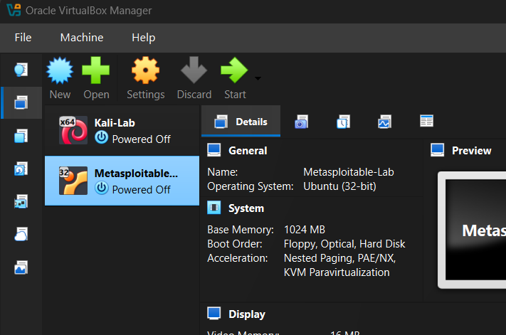
*Figure 9. Both VMs powered off before snapshot creation.*

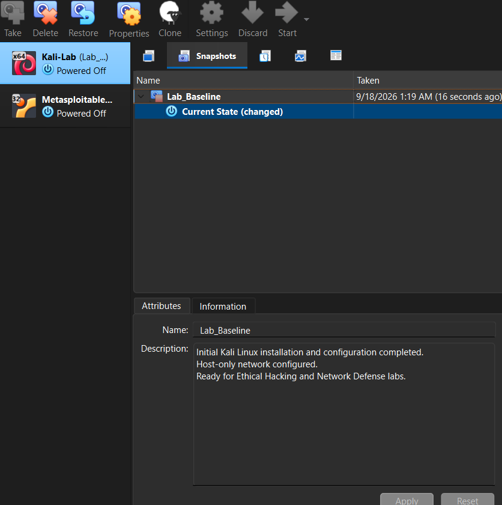
*Figure 10. Kali baseline snapshot with its saved description.*

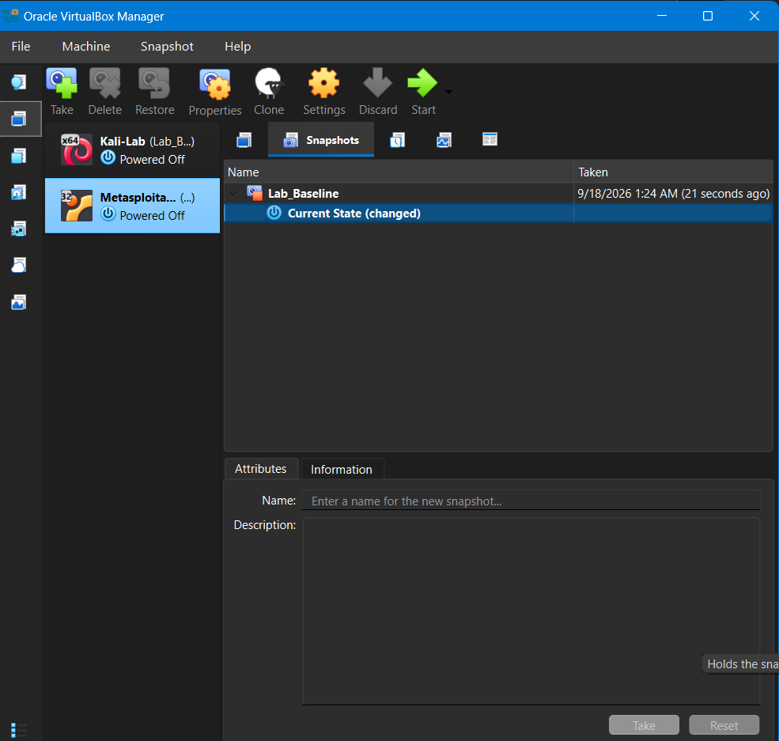
*Figure 11. Metasploitable baseline snapshot. This capture shows the name and time; its description is not displayed because Current State is selected.*

These snapshots provide recovery points if later labs cause configuration problems. Snapshot creation was completed; a restore test was not part of the recorded validation.

## Troubleshooting

| Issue | Resolution |
| --- | --- |
| Only NAT and Bridged Adapter appeared in Basic settings | Switched to Expert settings to access Host-only Adapter. |
| Initial Kali address command used an incomplete IPv4 address | Corrected it to 192.168.56.10/24, activated the profile, and verified eth0. |
| A new empty disk was attached to Metasploitable | Replaced the attachment with the existing Metasploitable.vmdk disk. |

## Reflection

This lab helped me see why I need to keep my testing environment separate, check that everything works, and have a way to restore my VMs if something goes wrong. Assigning static IP addresses gave each VM a consistent address for future labs. Fixing the network settings and checking the results also helped me become more comfortable working with VirtualBox and Linux commands.

## Documentation and evidence

- [Screenshot index](docs/Screenshot_Index.md)
- [Screenshot files](screenshots/)

The full virtualization screenshot is still to be added to this repository from the saved lab files. Both ping screenshots are included.

This repository contains documentation and screenshots only. VM disks, installation images, and actual snapshot files are not included.
